# Technical Analysis: Migrate File Uploads to Cloudinary

**Date:** 2026-04-16  
**Status:** Approved — Ready for Implementation  
**Author:** Development Team

---

## Table of Contents

1. [Executive Summary](#1-executive-summary)
2. [Current State Analysis](#2-current-state-analysis)
3. [Why Cloudinary](#3-why-cloudinary)
4. [Architecture & Diagrams](#4-architecture--diagrams)
   - [4.1 High-Level Architecture (Before vs After)](#41-high-level-architecture-before-vs-after)
   - [4.2 Component Diagram](#42-component-diagram)
   - [4.3 Sequence Diagram: Operator Registration Upload](#43-sequence-diagram-operator-registration-upload)
   - [4.4 Sequence Diagram: Receipt PDF Generation](#44-sequence-diagram-receipt-pdf-generation)
   - [4.5 Sequence Diagram: Accommodation Image Upload](#45-sequence-diagram-accommodation-image-upload)
   - [4.6 Data Flow Diagram](#46-data-flow-diagram)
   - [4.7 Upload Utility Decision Flowchart](#47-upload-utility-decision-flowchart)
   - [4.8 Entity-Relationship: File Storage Columns](#48-entity-relationship-file-storage-columns)
   - [4.9 Migration State Machine](#49-migration-state-machine)
   - [4.10 Future: Split Architecture Diagram](#410-future-split-architecture-diagram)
5. [Cloudinary Folder Structure](#5-cloudinary-folder-structure)
6. [Implementation Plan](#6-implementation-plan)
   - [Phase 1: Cloudinary Setup & Utility](#phase-1-cloudinary-setup--utility)
   - [Phase 2: Operator Registration Docs](#phase-2-operator-registration-docs-base64--cloudinary-url)
   - [Phase 3: Receipt PDFs](#phase-3-receipt-pdfs-disk--cloudinary)
   - [Phase 4: Accommodation Images](#phase-4-accommodation-images-base64--cloudinary-url)
   - [Phase 5: Association Logos](#phase-5-association-logos-disk--cloudinary)
   - [Phase 6: Existing Data Migration Script](#phase-6-existing-data-migration-script)
   - [Phase 7: Environment & Cleanup](#phase-7-environment--cleanup)
7. [File-by-File Changes Reference](#7-file-by-file-changes-reference)
8. [Database Migration Details](#8-database-migration-details)
9. [Image Transformation Strategy](#9-image-transformation-strategy)
10. [Frontend Impact Analysis](#10-frontend-impact-analysis)
11. [Testing Checklist](#11-testing-checklist)
12. [Future: Separating Image vs Document Storage](#12-future-separating-image-vs-document-storage)
13. [Rollback Strategy](#13-rollback-strategy)

---

## 1. Executive Summary

Replace all local file storage (Base64-in-database and files-on-disk) with **Cloudinary**. After migration, the server only stores **Cloudinary URLs** (short strings) in the database — no binary data, no local files. This eliminates both database bloat and server disk bloat.

**Key numbers:**

- 4 upload flows affected (operator registration, receipts, accommodations, associations)
- 7 file fields currently stored as Base64 `TEXT("long")` in MySQL
- Receipt PDFs currently stored on local disk (`/uploads/`)
- Association logos currently stored on local disk (`/uploads/associations/`)

---

## 2. Current State Analysis

### 2.1 Upload Flow: Operator Registration (4 files)

| Layer          | File                                | What Happens                                                                                                                                |
| -------------- | ----------------------------------- | ------------------------------------------------------------------------------------------------------------------------------------------- |
| **Frontend**   | `src/app/register/register.page.ts` | User selects up to 4 files. Validates type (PDF/JPG/PNG) and size (1MB each, 10MB total). Sends `FormData` via `POST /api/auth/register`.   |
| **Route**      | `routes/authRoutes.js`              | `upload.fields([...])` middleware (multer, memory storage) parses 4 upload fields.                                                          |
| **Middleware** | `middleware/uploadLogo.js`          | Multer with `memoryStorage()`. Validates MIME types per field. Max 1MB per file.                                                            |
| **Controller** | `controllers/authController.js`     | Calls `authService.register()` passing `req.files`.                                                                                         |
| **Service**    | `services/authService.js`           | Calls `toBase64DataUri(file)` to convert each buffer into `data:{mimetype};base64,...` string. Stores in `company` table.                   |
| **Model**      | `models/companyModel.js`            | 4 columns: `operator_logo_image`, `motac_license_file`, `trading_operation_license`, `homestay_certificate` — all `DataTypes.TEXT("long")`. |

**Current `toBase64DataUri()` function** (line 39 in `services/authService.js`):

```javascript
const toBase64DataUri = (file) => {
  if (!file || !file.buffer) return null;
  return `data:${file.mimetype};base64,${file.buffer.toString("base64")}`;
};
```

**Problem:** A 1MB PDF becomes ~1.33MB of Base64 text stored in MySQL. With 4 files per operator, each registration adds up to ~5.3MB to the database.

### 2.2 Upload Flow: Receipt PDFs

| Layer             | File                               | What Happens                                                                                                                                                               |
| ----------------- | ---------------------------------- | -------------------------------------------------------------------------------------------------------------------------------------------------------------------------- |
| **Frontend**      | `src/app/receipt/receipt.page.ts`  | Captures receipt HTML via `html2canvas`, converts to PNG blob, sends via `FormData`.                                                                                       |
| **Route**         | `routes/receiptRoutes.js`          | Inline `multer({ storage: memoryStorage() }).single('receiptImage')` middleware.                                                                                           |
| **Controller**    | `controllers/receiptController.js` | Gets image buffer, embeds as Base64 in HTML, launches Puppeteer, generates PDF, writes to `/uploads/receipt_{id}.pdf`. Returns `{ fileUrl: '/uploads/receipt_{id}.pdf' }`. |
| **Frontend (QR)** | `receipt.page.ts` line 113         | Constructs full URL: `this.pdfLink = this.testAPI + this.pdfUrl` (e.g., `https://api.example.com/uploads/receipt_PE123.pdf`).                                              |

**Problem:** PDF files accumulate on the server's disk. No cleanup mechanism exists.

### 2.3 Upload Flow: Accommodation Images

| Layer          | File                             | What Happens                                                                                                                    |
| -------------- | -------------------------------- | ------------------------------------------------------------------------------------------------------------------------------- |
| **Controller** | `controllers/accomController.js` | Receives `image` from `req.body` (already Base64 string from frontend). Stores directly into `accommodation_list.image` column. |
| **Model**      | `models/accomModel.js`           | Column `image: DataTypes.TEXT("long")`.                                                                                         |

**Problem:** Same as operator docs — Base64 bloats the database.

### 2.4 Upload Flow: Association Logos

| Layer          | File                                   | What Happens                                                                                                           |
| -------------- | -------------------------------------- | ---------------------------------------------------------------------------------------------------------------------- |
| **Controller** | `controllers/associationController.js` | Simple CRUD — `getAll()` returns all associations.                                                                     |
| **Model**      | `models/associationModel.js`           | Column `image: DataTypes.STRING`. Stores filename strings (e.g., `kata_logo.jpg`).                                     |
| **Disk**       | `/uploads/associations/`               | Static files: `kata_logo.jpg`, `kobeta_logo.jpg`, `komtda_logo.jpg`, `nta_logo.jpg`, `rata_logo.jpg`, `usta_logo.jpg`. |

**Problem:** Files on local disk. If the server is rebuilt, logos are lost.

---

## 3. Why Cloudinary

### 3.1 Comparison

| Service                        | Free Tier                              | Image Transforms           | CDN            | PDF Support                  | API Complexity                  |
| ------------------------------ | -------------------------------------- | -------------------------- | -------------- | ---------------------------- | ------------------------------- |
| **Cloudinary**                 | **25 GB storage + 25 GB bandwidth/mo** | Yes (resize, crop, format) | Yes (global)   | Yes (`resource_type: "raw"`) | Simple                          |
| Google Drive (Service Account) | 15 GB                                  | No                         | No             | Yes                          | Complex (OAuth/Service Account) |
| Firebase Storage               | 5 GB                                   | No                         | Yes            | Yes                          | Medium                          |
| AWS S3                         | 5 GB (12 months)                       | No (needs Lambda)          | Via CloudFront | Yes                          | Medium                          |
| Supabase Storage               | 1 GB                                   | No                         | Limited        | Yes                          | Simple                          |

### 3.2 Why Cloudinary Wins for This Project

1. **25 GB free tier** — more than enough for this project's volume.
2. **Image transformations** — resize operator logos and accommodation images on-the-fly via URL parameters (no server processing needed).
3. **Global CDN** — images load fast for tourists worldwide.
4. **Simple SDK** — `cloudinary.uploader.upload_stream()` accepts multer buffers directly. No temporary files.
5. **Handles both images and PDFs** — `resource_type: "image"` for images, `resource_type: "raw"` for PDFs/documents. One service for everything.
6. **No infrastructure to manage** — no S3 buckets, no IAM policies, no Firebase rules.

### 3.3 Trade-off: All Files on Cloudinary vs Split Services

**Current decision: All files on Cloudinary** (images + documents).

Cloudinary is optimized for images (transformations, CDN, format optimization). For PDFs/docs, it simply stores and serves them as raw files with no special treatment. This is fine for our project because:

- Volume is small (< 2 GB expected)
- Simplicity of one service, one config, one utility
- 25 GB free tier covers all file types easily

**When to split** (see [Section 12](#12-future-separating-image-vs-document-storage) for the full plan):

- If accommodation images grow to hundreds of listings with multiple photos
- If PDF volume exceeds reasonable Cloudinary free tier usage
- If you need document-specific features (versioning, OCR, etc.)

---

## 4. Architecture & Diagrams

### 4.1 High-Level Architecture (Before vs After)

#### BEFORE — Current Architecture

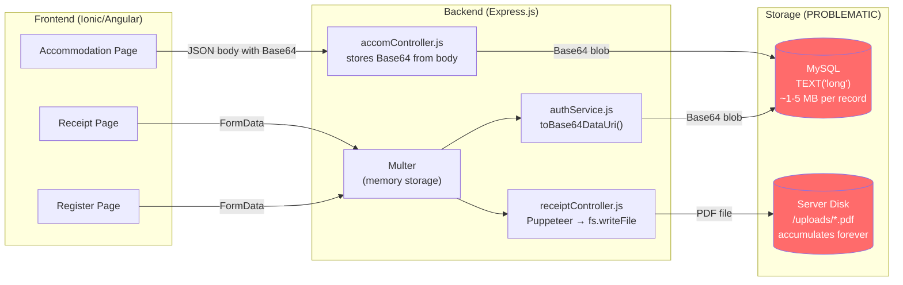

#### AFTER — Cloudinary Architecture

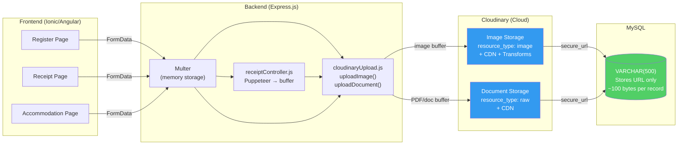

---

### 4.2 Component Diagram

Shows all backend components involved and their relationships.

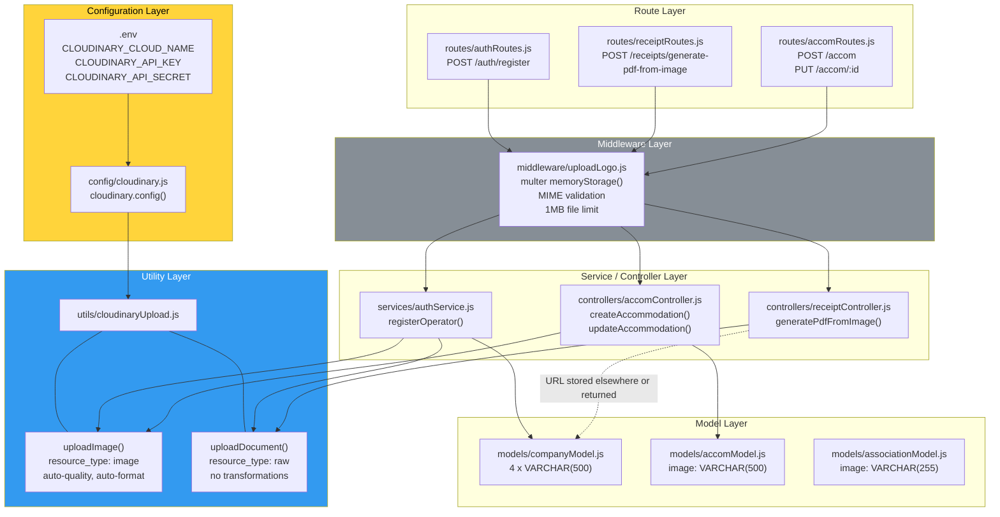

---

### 4.3 Sequence Diagram: Operator Registration Upload

Complete flow from user selecting files to URL stored in database.

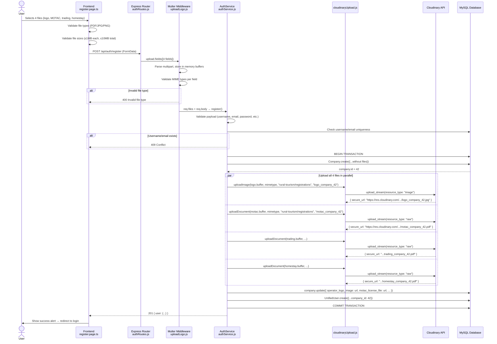

---

### 4.4 Sequence Diagram: Receipt PDF Generation

Flow from receipt capture to Cloudinary-hosted PDF with QR code.

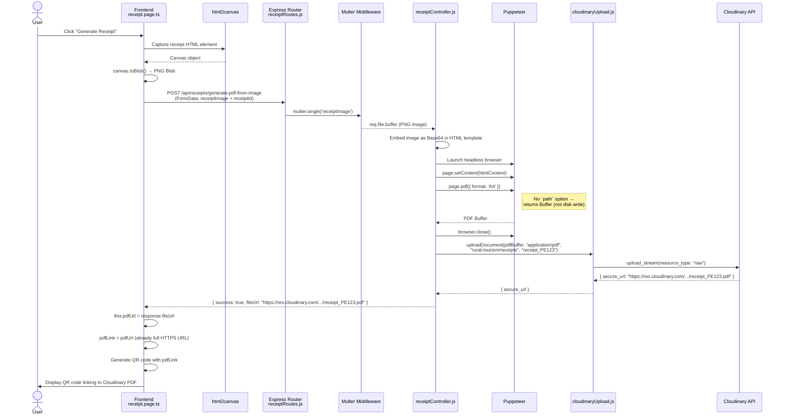

---

### 4.5 Sequence Diagram: Accommodation Image Upload

Shows the new flow using file upload via FormData (Option A).

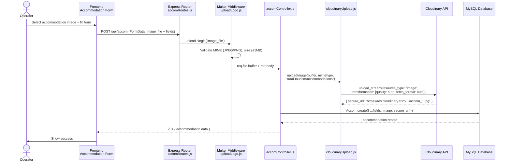

---

### 4.6 Data Flow Diagram

Overview of all data flows in the system after migration.

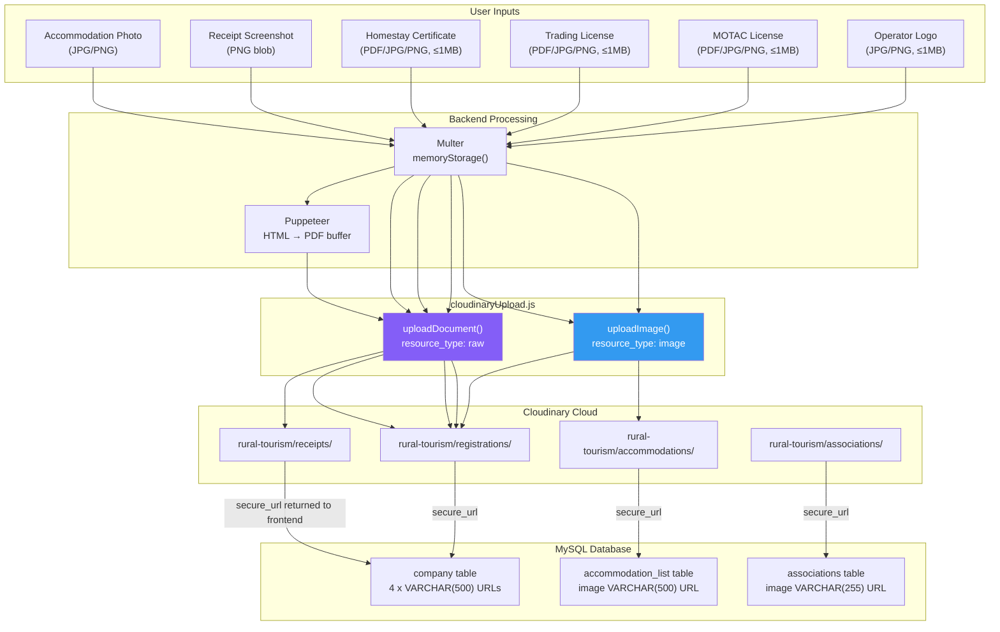

---

### 4.7 Upload Utility Decision Flowchart

How the code decides which upload function to use.

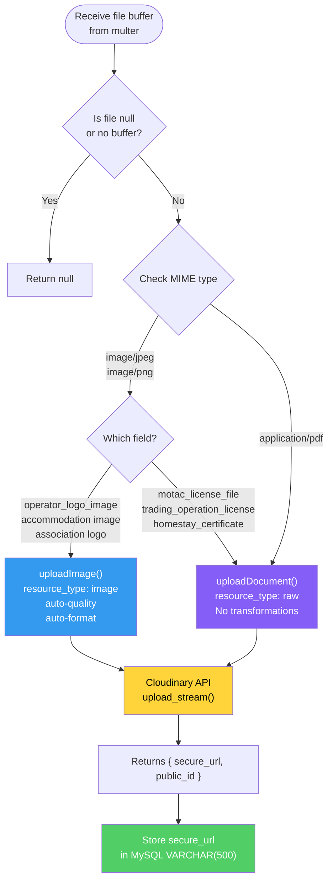

---

### 4.8 Entity-Relationship: File Storage Columns

Database schema changes — before and after migration.

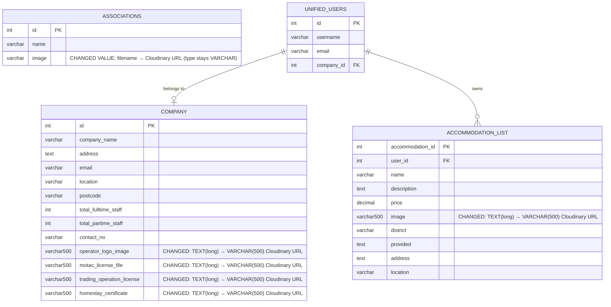

---

### 4.9 Migration State Machine

Shows the execution order for the data migration process.

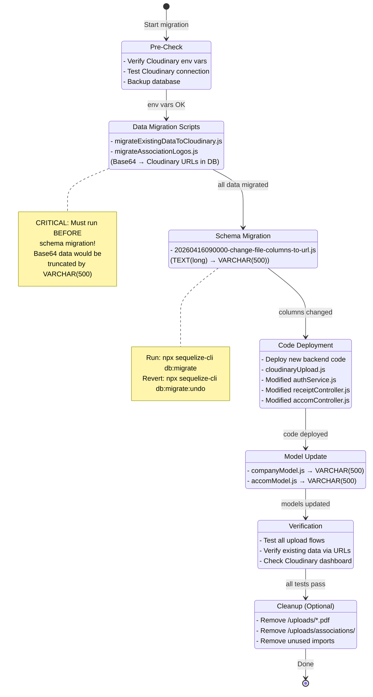

---

### 4.10 Future: Split Architecture Diagram

When the project grows and the team decides to separate image and document storage:

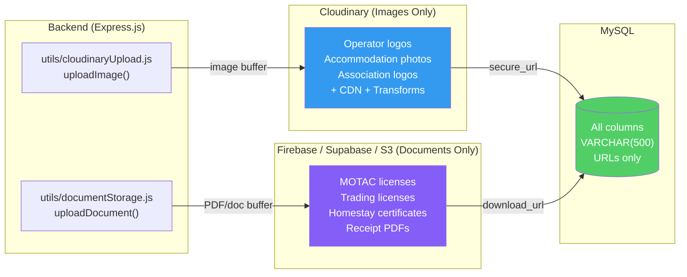

**Why this split is easy:** The current code already separates `uploadImage()` and `uploadDocument()`. To split, you just:

1. Create `utils/documentStorage.js` with the same `uploadDocument(buffer, mimetype, folder)` interface
2. Change the `require()` in 2-3 files
3. No controller, route, or frontend changes needed

---

### 4.11 Utility Design: `utils/cloudinaryUpload.js`

**Two exported functions** in a single file:

| Function                                                 | `resource_type` | Use Case                                                    | Transformations           |
| -------------------------------------------------------- | --------------- | ----------------------------------------------------------- | ------------------------- |
| `uploadImage(fileBuffer, mimetype, folder, publicId)`    | `"image"`       | Logos, accommodation photos, association logos              | Auto-quality, auto-format |
| `uploadDocument(fileBuffer, mimetype, folder, publicId)` | `"raw"`         | MOTAC license, trading license, homestay cert, receipt PDFs | None                      |

**Which function to call for each field:**

| Field                       | Function           | Folder                         |
| --------------------------- | ------------------ | ------------------------------ |
| `operator_logo_image`       | `uploadImage()`    | `rural-tourism/registrations`  |
| `motac_license_file`        | `uploadDocument()` | `rural-tourism/registrations`  |
| `trading_operation_license` | `uploadDocument()` | `rural-tourism/registrations`  |
| `homestay_certificate`      | `uploadDocument()` | `rural-tourism/registrations`  |
| Receipt PDFs                | `uploadDocument()` | `rural-tourism/receipts`       |
| `accommodation.image`       | `uploadImage()`    | `rural-tourism/accommodations` |
| Association logos           | `uploadImage()`    | `rural-tourism/associations`   |

---

## 5. Cloudinary Folder Structure

```
rural-tourism/
├── registrations/        ← operator logos + license docs
│   ├── logo_company_{id}.jpg
│   ├── motac_company_{id}.pdf
│   ├── trading_company_{id}.pdf
│   └── homestay_company_{id}.pdf
├── receipts/             ← generated receipt PDFs
│   └── receipt_{receiptId}.pdf
├── accommodations/       ← accommodation listing images
│   └── accom_{accommodation_id}.jpg
└── associations/         ← association logos
    ├── kata_logo.jpg
    ├── kobeta_logo.jpg
    └── ...
```

---

## 6. Implementation Plan

### Phase 1: Cloudinary Setup & Utility

> **Goal:** Install Cloudinary SDK and create reusable upload utility.

#### Step 1.1 — Install Cloudinary Package

```bash
cd rural-tourism-backend
npm install cloudinary
```

#### Step 1.2 — Create `config/cloudinary.js`

```javascript
// config/cloudinary.js
const cloudinary = require("cloudinary").v2;

cloudinary.config({
  cloud_name: process.env.CLOUDINARY_CLOUD_NAME,
  api_key: process.env.CLOUDINARY_API_KEY,
  api_secret: process.env.CLOUDINARY_API_SECRET,
});

module.exports = cloudinary;
```

#### Step 1.3 — Create `utils/cloudinaryUpload.js`

```javascript
// utils/cloudinaryUpload.js
const cloudinary = require("../config/cloudinary");

/**
 * Upload an image to Cloudinary.
 * Applies auto-quality and auto-format transformations.
 *
 * @param {Buffer} fileBuffer - The file buffer from multer memoryStorage.
 * @param {string} mimetype   - The MIME type (e.g. "image/jpeg").
 * @param {string} folder     - Cloudinary folder (e.g. "rural-tourism/registrations").
 * @param {string} [publicId] - Optional custom public_id (filename without extension).
 * @returns {Promise<{ secure_url: string, public_id: string }>}
 */
const uploadImage = (fileBuffer, mimetype, folder, publicId = undefined) => {
  return new Promise((resolve, reject) => {
    const options = {
      folder,
      resource_type: "image",
      transformation: [{ quality: "auto", fetch_format: "auto" }],
    };

    if (publicId) {
      options.public_id = publicId;
      options.overwrite = true;
    }

    const uploadStream = cloudinary.uploader.upload_stream(
      options,
      (error, result) => {
        if (error) return reject(error);
        resolve({ secure_url: result.secure_url, public_id: result.public_id });
      },
    );

    uploadStream.end(fileBuffer);
  });
};

/**
 * Upload a document (PDF, etc.) to Cloudinary as a raw file.
 * No image transformations are applied.
 *
 * @param {Buffer} fileBuffer - The file buffer from multer memoryStorage.
 * @param {string} mimetype   - The MIME type (e.g. "application/pdf").
 * @param {string} folder     - Cloudinary folder (e.g. "rural-tourism/receipts").
 * @param {string} [publicId] - Optional custom public_id (filename without extension).
 * @returns {Promise<{ secure_url: string, public_id: string }>}
 */
const uploadDocument = (fileBuffer, mimetype, folder, publicId = undefined) => {
  return new Promise((resolve, reject) => {
    const options = {
      folder,
      resource_type: "raw",
    };

    if (publicId) {
      options.public_id = publicId;
      options.overwrite = true;
    }

    const uploadStream = cloudinary.uploader.upload_stream(
      options,
      (error, result) => {
        if (error) return reject(error);
        resolve({ secure_url: result.secure_url, public_id: result.public_id });
      },
    );

    uploadStream.end(fileBuffer);
  });
};

module.exports = { uploadImage, uploadDocument };
```

#### Step 1.4 — Add Environment Variables to `.env.example`

Append to the bottom of `.env.example`:

```env
# Cloudinary Configuration
# Sign up at https://cloudinary.com (free: 25GB storage + 25GB bandwidth/month)
# Find your credentials at: https://console.cloudinary.com/settings/api-keys
CLOUDINARY_CLOUD_NAME=your_cloud_name
CLOUDINARY_API_KEY=your_api_key
CLOUDINARY_API_SECRET=your_api_secret
```

---

### Phase 2: Operator Registration Docs (Base64 → Cloudinary URL)

> **Goal:** Replace `toBase64DataUri()` calls with Cloudinary uploads in `services/authService.js`.  
> **Frontend impact:** NONE — still sends `FormData`, backend handles the rest.

#### Step 2.1 — Modify `services/authService.js`

**Replace the `toBase64DataUri` function** (line 39) with a Cloudinary upload helper:

```javascript
// REMOVE this:
const toBase64DataUri = (file) => {
  if (!file || !file.buffer) return null;
  return `data:${file.mimetype};base64,${file.buffer.toString("base64")}`;
};

// ADD this import at the top:
const { uploadImage, uploadDocument } = require("../utils/cloudinaryUpload");

// ADD this helper function:
const REGISTRATION_FOLDER = "rural-tourism/registrations";

const uploadRegistrationFile = async (file, fieldName, companyId) => {
  if (!file || !file.buffer) return null;

  const publicId = `${fieldName}_company_${companyId}`;
  const isImage = file.mimetype.startsWith("image/");

  if (isImage && fieldName === "operator_logo_image") {
    const result = await uploadImage(
      file.buffer,
      file.mimetype,
      REGISTRATION_FOLDER,
      publicId,
    );
    return result.secure_url;
  }

  const result = await uploadDocument(
    file.buffer,
    file.mimetype,
    REGISTRATION_FOLDER,
    publicId,
  );
  return result.secure_url;
};
```

**Modify the `registerOperator` method** — change the `Company.create()` call.

Current code (inside `registerOperator`, within the transaction):

```javascript
const company = await Company.create(
  {
    company_name: companyName,
    address: payload.business_address || null,
    email: userEmail,
    location: payload.location || null,
    postcode: normalizedPoscode,
    total_fulltime_staff: parseNullableInt(payload.no_of_full_time_staff),
    total_partime_staff: parseNullableInt(payload.no_of_part_time_staff),
    contact_no: payload.contact_no || null,
    operator_logo_image: toBase64DataUri(logoFile),
    motac_license_file: toBase64DataUri(motacFile),
    trading_operation_license: toBase64DataUri(tradingOperationFile),
    homestay_certificate: toBase64DataUri(homestayFile),
  },
  { transaction },
);
```

Replace with:

```javascript
// Step 1: Create company WITHOUT files (to get the company ID)
const company = await Company.create(
  {
    company_name: companyName,
    address: payload.business_address || null,
    email: userEmail,
    location: payload.location || null,
    postcode: normalizedPoscode,
    total_fulltime_staff: parseNullableInt(payload.no_of_full_time_staff),
    total_partime_staff: parseNullableInt(payload.no_of_part_time_staff),
    contact_no: payload.contact_no || null,
  },
  { transaction },
);

// Step 2: Upload files to Cloudinary (needs company.id for naming)
const [logoUrl, motacUrl, tradingUrl, homestayUrl] = await Promise.all([
  uploadRegistrationFile(logoFile, "logo", company.id),
  uploadRegistrationFile(motacFile, "motac", company.id),
  uploadRegistrationFile(tradingOperationFile, "trading", company.id),
  uploadRegistrationFile(homestayFile, "homestay", company.id),
]);

// Step 3: Update company with Cloudinary URLs
await company.update(
  {
    operator_logo_image: logoUrl,
    motac_license_file: motacUrl,
    trading_operation_license: tradingUrl,
    homestay_certificate: homestayUrl,
  },
  { transaction },
);
```

> **Note:** We create the company first to get the ID for Cloudinary filenames. If Cloudinary upload fails, the transaction rolls back, so no orphan DB records.

#### Step 2.2 — Keep `middleware/uploadLogo.js` As-Is

No changes needed. Multer with `memoryStorage()` is exactly what Cloudinary SDK expects — it provides `file.buffer` which we pass to `upload_stream().end(buffer)`.

---

### Phase 3: Receipt PDFs (Disk → Cloudinary)

> **Goal:** After Puppeteer generates the PDF in memory, upload to Cloudinary instead of writing to `/uploads/`.  
> **Frontend impact:** The returned `fileUrl` changes from `/uploads/receipt_X.pdf` to a Cloudinary HTTPS URL.

#### Step 3.1 — Modify `controllers/receiptController.js`

Current code (after Puppeteer generates the PDF):

```javascript
// Current: writes to local disk
const pdfFilePath = path.join(__dirname, "../uploads", uniqueFileName);

await page.pdf({
  path: pdfFilePath,
  format: "A4",
  printBackground: true,
  landscape: false,
});

await browser.close();
res.json({ success: true, fileUrl: `/uploads/${uniqueFileName}` });
```

Replace with:

```javascript
const { uploadDocument } = require("../utils/cloudinaryUpload");

// ... inside generatePdfFromImage, after page.setContent(htmlContent):

// Generate PDF as buffer (no path = returns buffer)
const pdfBuffer = await page.pdf({
  format: "A4",
  printBackground: true,
  landscape: false,
});

await browser.close();

// Upload to Cloudinary
const publicId = `receipt_${receiptId}`;
const { secure_url } = await uploadDocument(
  pdfBuffer,
  "application/pdf",
  "rural-tourism/receipts",
  publicId,
);

res.json({ success: true, fileUrl: secure_url });
```

> **Key change:** Removed `path:` option from `page.pdf()` — when omitted, Puppeteer returns a Buffer instead of writing to disk. This buffer goes directly to Cloudinary.

#### Step 3.2 — Remove unused imports in `receiptController.js`

After modification, these imports are no longer needed:

```javascript
// REMOVE these:
const fs = require("fs");
const path = require("path");
const { v4: uuidv4 } = require("uuid");

// ALSO REMOVE the uploadsDir setup:
const uploadsDir = path.join(__dirname, "../uploads");
if (!fs.existsSync(uploadsDir)) {
  fs.mkdirSync(uploadsDir);
}
```

#### Step 3.3 — Update Frontend Receipt URL Handling

**File:** `src/app/receipt/receipt.page.ts`

Current code (line 110-113):

```typescript
if (this.pdfUrl) {
  this.qrCodeReady = true;
  this.cdr.detectChanges();
  this.pdfLink = this.testAPI + this.pdfUrl;
```

The old `pdfUrl` was a relative path like `/uploads/receipt_PE123.pdf`, so the frontend prefixed it with the API base URL. Now `pdfUrl` is a full Cloudinary HTTPS URL (e.g., `https://res.cloudinary.com/xxx/raw/upload/v123/rural-tourism/receipts/receipt_PE123.pdf`).

**Change to:**

```typescript
if (this.pdfUrl) {
  this.qrCodeReady = true;
  this.cdr.detectChanges();
  // Cloudinary returns a full HTTPS URL — use it directly
  this.pdfLink = this.pdfUrl.startsWith('http') ? this.pdfUrl : this.testAPI + this.pdfUrl;
```

This change is **backward-compatible** — if `pdfUrl` is a full URL (Cloudinary), use it directly. If it's a relative path (old format), prepend the API base URL.

Apply the same pattern to:

- `src/app/receipt-package/receipt-package.page.ts` (if it has similar QR URL construction)
- `src/app/receipt-activity/receipt-activity.page.ts` (if it has similar QR URL construction)

---

### Phase 4: Accommodation Images (Base64 → Cloudinary URL)

> **Goal:** Replace Base64 image strings with Cloudinary URLs for accommodations.  
> **Complexity:** Medium — the frontend currently sends Base64 in `req.body.image`, not a file upload.

#### Step 4.1 — Current Flow Analysis

The accommodation create/update endpoints receive `image` as a Base64 data URI string directly in `req.body` (not via multer). This means the frontend is converting images to Base64 client-side.

**Two approaches:**

**Option A (Recommended):** Add multer middleware for accommodation routes, send the image as `FormData` from the frontend, upload to Cloudinary on the backend. This is the cleanest solution.

**Option B (Minimal change):** Accept Base64 from frontend, decode the buffer server-side, upload to Cloudinary. Less frontend change, but still sends large Base64 payloads over the network.

We recommend **Option A** for consistency with the registration flow.

#### Step 4.2 — Backend: Add Upload Middleware to Accommodation Routes

**File:** `routes/accomRoutes.js`

Add multer middleware for accommodation create and update:

```javascript
// Add at top:
const upload = require("../middleware/uploadLogo");
const accomUpload = upload.single("image_file");

// Modify create route:
router.post(
  "/",
  authenticate,
  authorize("accommodation:create"),
  accomUpload, // Add this
  asyncHandler(accomController.createAccommodation),
);

// Modify update route:
router.put(
  "/:id",
  authenticate,
  authorize("accommodation:update"),
  accomUpload, // Add this
  asyncHandler(accomController.updateAccommodation),
);
```

**File:** `middleware/uploadLogo.js`

Add `image_file` to the allowed MIME types:

```javascript
const allowedMimeTypesByField = {
  operator_logo_image: ["image/jpeg", "image/png"],
  motac_license_file: ["application/pdf", "image/jpeg", "image/png"],
  trading_operation_license: ["application/pdf", "image/jpeg", "image/png"],
  homestay_certificate: ["application/pdf", "image/jpeg", "image/png"],
  company_logo: ["image/jpeg", "image/png"],
  image_file: ["image/jpeg", "image/png"], // ADD THIS
};
```

#### Step 4.3 — Backend: Modify `controllers/accomController.js`

In `createAccommodation`:

```javascript
const { uploadImage } = require("../utils/cloudinaryUpload");

// Inside createAccommodation, before Accom.create():
let imageUrl = image || null; // fallback to req.body.image for backward compat

if (req.file && req.file.buffer) {
  const result = await uploadImage(
    req.file.buffer,
    req.file.mimetype,
    "rural-tourism/accommodations",
  );
  imageUrl = result.secure_url;
}

// Then use imageUrl in Accom.create():
const newAccommodation = await Accom.create({
  // ... other fields
  image: imageUrl,
  // ...
});
```

Apply similar logic in `updateAccommodation`.

#### Step 4.4 — Frontend: Send Image as File Upload (Optional)

If the frontend currently converts images to Base64 before sending, modify it to send the original `File` object via `FormData` instead. This reduces payload size and is more efficient.

> **Note:** This is optional if you choose Option B. With Option B, the backend can decode the Base64 string back to a buffer and upload to Cloudinary. But Option A is cleaner.

---

### Phase 5: Association Logos (Disk → Cloudinary)

> **Goal:** Upload the 6 existing static logos to Cloudinary once, then update DB records with URLs.

#### Step 5.1 — One-Time Upload Script

Create `scripts/migrateAssociationLogos.js`:

```javascript
// scripts/migrateAssociationLogos.js
require("dotenv").config();
const fs = require("fs");
const path = require("path");
const sequelize = require("../config/db");
const Association = require("../models/associationModel");
const { uploadImage } = require("../utils/cloudinaryUpload");

const LOGOS_DIR = path.join(__dirname, "../uploads/associations");
const FOLDER = "rural-tourism/associations";

async function migrate() {
  console.log("Starting association logo migration to Cloudinary...\n");

  const associations = await Association.findAll();

  for (const assoc of associations) {
    if (!assoc.image) {
      console.log(`[SKIP] Association #${assoc.id} "${assoc.name}" — no image`);
      continue;
    }

    // Already a URL? Skip.
    if (assoc.image.startsWith("http")) {
      console.log(
        `[SKIP] Association #${assoc.id} "${assoc.name}" — already a URL`,
      );
      continue;
    }

    const filePath = path.join(LOGOS_DIR, assoc.image);

    if (!fs.existsSync(filePath)) {
      console.log(
        `[WARN] Association #${assoc.id} "${assoc.name}" — file not found: ${filePath}`,
      );
      continue;
    }

    const buffer = fs.readFileSync(filePath);
    const ext = path.extname(assoc.image).toLowerCase();
    const mimetype = ext === ".png" ? "image/png" : "image/jpeg";
    const publicId = path.basename(assoc.image, ext);

    try {
      const { secure_url } = await uploadImage(
        buffer,
        mimetype,
        FOLDER,
        publicId,
      );
      await assoc.update({ image: secure_url });
      console.log(
        `[OK]   Association #${assoc.id} "${assoc.name}" → ${secure_url}`,
      );
    } catch (err) {
      console.error(
        `[FAIL] Association #${assoc.id} "${assoc.name}" — ${err.message}`,
      );
    }
  }

  console.log("\nDone.");
  await sequelize.close();
}

migrate().catch((err) => {
  console.error("Migration failed:", err);
  process.exit(1);
});
```

**Run:**

```bash
node scripts/migrateAssociationLogos.js
```

---

### Phase 6: Existing Data Migration Script

> **Goal:** Migrate existing Base64 data in `company` and `accommodation_list` tables to Cloudinary.

Create `scripts/migrateExistingDataToCloudinary.js`:

```javascript
// scripts/migrateExistingDataToCloudinary.js
require("dotenv").config();
const sequelize = require("../config/db");
const Company = require("../models/companyModel");
const Accom = require("../models/accomModel");
const { uploadImage, uploadDocument } = require("../utils/cloudinaryUpload");

const REG_FOLDER = "rural-tourism/registrations";
const ACCOM_FOLDER = "rural-tourism/accommodations";

/**
 * Convert a data URI (data:mimetype;base64,...) back to a Buffer + mimetype.
 */
function parseDataUri(dataUri) {
  if (!dataUri || !dataUri.startsWith("data:")) return null;
  const match = dataUri.match(/^data:([^;]+);base64,(.+)$/);
  if (!match) return null;
  return { mimetype: match[1], buffer: Buffer.from(match[2], "base64") };
}

async function migrateCompanyFiles() {
  console.log("=== Migrating Company Files ===\n");

  const companies = await Company.findAll();
  let migrated = 0;
  let skipped = 0;

  for (const company of companies) {
    const fields = [
      { column: "operator_logo_image", type: "image", name: "logo" },
      { column: "motac_license_file", type: "document", name: "motac" },
      {
        column: "trading_operation_license",
        type: "document",
        name: "trading",
      },
      { column: "homestay_certificate", type: "document", name: "homestay" },
    ];

    const updates = {};

    for (const field of fields) {
      const value = company[field.column];

      // Skip if null, empty, or already a URL
      if (!value || value.startsWith("http")) {
        continue;
      }

      const parsed = parseDataUri(value);
      if (!parsed) {
        console.log(
          `  [WARN] Company #${company.id} ${field.column} — not a valid data URI, skipping`,
        );
        continue;
      }

      const publicId = `${field.name}_company_${company.id}`;
      const uploadFn = field.type === "image" ? uploadImage : uploadDocument;

      try {
        const { secure_url } = await uploadFn(
          parsed.buffer,
          parsed.mimetype,
          REG_FOLDER,
          publicId,
        );
        updates[field.column] = secure_url;
        console.log(
          `  [OK] Company #${company.id} ${field.column} → ${secure_url}`,
        );
      } catch (err) {
        console.error(
          `  [FAIL] Company #${company.id} ${field.column} — ${err.message}`,
        );
      }
    }

    if (Object.keys(updates).length > 0) {
      await company.update(updates);
      migrated++;
    } else {
      skipped++;
    }
  }

  console.log(`\nCompanies: ${migrated} migrated, ${skipped} skipped\n`);
}

async function migrateAccommodationImages() {
  console.log("=== Migrating Accommodation Images ===\n");

  const accommodations = await Accom.findAll();
  let migrated = 0;
  let skipped = 0;

  for (const accom of accommodations) {
    const value = accom.image;

    if (!value || value.startsWith("http")) {
      skipped++;
      continue;
    }

    const parsed = parseDataUri(value);
    if (!parsed) {
      console.log(
        `  [WARN] Accommodation #${accom.accommodation_id} — not a valid data URI, skipping`,
      );
      skipped++;
      continue;
    }

    const publicId = `accom_${accom.accommodation_id}`;

    try {
      const { secure_url } = await uploadImage(
        parsed.buffer,
        parsed.mimetype,
        ACCOM_FOLDER,
        publicId,
      );
      await accom.update({ image: secure_url });
      console.log(
        `  [OK] Accommodation #${accom.accommodation_id} → ${secure_url}`,
      );
      migrated++;
    } catch (err) {
      console.error(
        `  [FAIL] Accommodation #${accom.accommodation_id} — ${err.message}`,
      );
      skipped++;
    }
  }

  console.log(`\nAccommodations: ${migrated} migrated, ${skipped} skipped\n`);
}

async function main() {
  console.log("Starting existing data migration to Cloudinary...\n");
  console.log(
    "NOTE: This script is IDEMPOTENT — it skips records that already have URLs.\n",
  );

  await migrateCompanyFiles();
  await migrateAccommodationImages();

  console.log("=== Migration Complete ===");
  await sequelize.close();
}

main().catch((err) => {
  console.error("Migration failed:", err);
  process.exit(1);
});
```

**Run:**

```bash
node scripts/migrateExistingDataToCloudinary.js
```

> **Important:** This script is **idempotent** — it checks if a value already starts with `http` (URL) and skips it. Safe to run multiple times.

---

### Phase 7: Environment & Cleanup

#### Step 7.1 — Add npm Script Shortcuts

In `package.json`, add to `"scripts"`:

```json
"migrate:cloudinary": "node scripts/migrateExistingDataToCloudinary.js",
"migrate:association-logos": "node scripts/migrateAssociationLogos.js"
```

#### Step 7.2 — Database Migration (Column Type Change)

Create a Sequelize migration to change column types from `TEXT("long")` to `STRING(500)`:

**File:** `migrations/20260416090000-change-file-columns-to-url.js`

```javascript
"use strict";

module.exports = {
  async up(queryInterface, Sequelize) {
    // Company table — 4 file columns
    await queryInterface.changeColumn("company", "operator_logo_image", {
      type: Sequelize.STRING(500),
      allowNull: true,
    });
    await queryInterface.changeColumn("company", "motac_license_file", {
      type: Sequelize.STRING(500),
      allowNull: true,
    });
    await queryInterface.changeColumn("company", "trading_operation_license", {
      type: Sequelize.STRING(500),
      allowNull: true,
    });
    await queryInterface.changeColumn("company", "homestay_certificate", {
      type: Sequelize.STRING(500),
      allowNull: true,
    });

    // Accommodation table — image column
    await queryInterface.changeColumn("accommodation_list", "image", {
      type: Sequelize.STRING(500),
      allowNull: true,
    });
  },

  async down(queryInterface, Sequelize) {
    // Revert to TEXT("long")
    await queryInterface.changeColumn("company", "operator_logo_image", {
      type: Sequelize.TEXT("long"),
      allowNull: true,
    });
    await queryInterface.changeColumn("company", "motac_license_file", {
      type: Sequelize.TEXT("long"),
      allowNull: true,
    });
    await queryInterface.changeColumn("company", "trading_operation_license", {
      type: Sequelize.TEXT("long"),
      allowNull: true,
    });
    await queryInterface.changeColumn("company", "homestay_certificate", {
      type: Sequelize.TEXT("long"),
      allowNull: true,
    });
    await queryInterface.changeColumn("accommodation_list", "image", {
      type: Sequelize.TEXT("long"),
      allowNull: true,
    });
  },
};
```

**Run order (CRITICAL):**

```bash
# 1. FIRST — Run data migration (uploads Base64 to Cloudinary, updates rows with URLs)
npm run migrate:cloudinary
npm run migrate:association-logos

# 2. THEN — Run column type migration (shrinks columns to VARCHAR(500))
npx sequelize-cli db:migrate

# DO NOT reverse this order. If you shrink columns first, Base64 data gets truncated.
```

#### Step 7.3 — Update Model Definitions

After the DB migration runs, update the Sequelize model definitions to match:

**File:** `models/companyModel.js` — Change all 4 columns:

```javascript
// Change from:
operator_logo_image: { type: DataTypes.TEXT("long"), allowNull: true },
// Change to:
operator_logo_image: { type: DataTypes.STRING(500), allowNull: true },
```

Apply to all 4 columns: `operator_logo_image`, `motac_license_file`, `trading_operation_license`, `homestay_certificate`.

**File:** `models/accomModel.js` — Change image column:

```javascript
// Change from:
image: { type: DataTypes.TEXT("long"), allowNull: true },
// Change to:
image: { type: DataTypes.STRING(500), allowNull: true },
```

#### Step 7.4 — Static File Serving (Keep Temporarily)

Do NOT immediately remove the Express static file serving for `/uploads/`. Old receipt PDF URLs in QR codes will still point to the server. Keep serving static files until all existing QR codes have expired/rotated.

#### Step 7.5 — Remove Unused Local File Writes

After confirming Cloudinary works:

- Remove the `uploadsDir` setup code in `receiptController.js`
- Remove `uuid` dependency if no longer used elsewhere
- Do NOT delete `/uploads/associations/` or `/uploads/*.pdf` until you're confident no one references them

---

## 7. File-by-File Changes Reference

### Backend Files to Modify

| File                               | Change                                                                     | Phase |
| ---------------------------------- | -------------------------------------------------------------------------- | ----- |
| `package.json`                     | Add `cloudinary` dependency, add migration scripts                         | 1     |
| `.env.example`                     | Add `CLOUDINARY_CLOUD_NAME`, `CLOUDINARY_API_KEY`, `CLOUDINARY_API_SECRET` | 1     |
| `services/authService.js`          | Remove `toBase64DataUri()`, add Cloudinary upload logic                    | 2     |
| `controllers/receiptController.js` | Replace disk write with Cloudinary upload, remove `fs`/`path`/`uuid`       | 3     |
| `controllers/accomController.js`   | Add Cloudinary upload for image field                                      | 4     |
| `routes/accomRoutes.js`            | Add multer middleware on create/update routes                              | 4     |
| `middleware/uploadLogo.js`         | Add `image_file` to allowed MIME types                                     | 4     |
| `models/companyModel.js`           | Change 4 columns from `TEXT("long")` to `STRING(500)`                      | 7     |
| `models/accomModel.js`             | Change `image` from `TEXT("long")` to `STRING(500)`                        | 7     |

### Backend Files to Create

| File                                                      | Purpose                                                   | Phase |
| --------------------------------------------------------- | --------------------------------------------------------- | ----- |
| `config/cloudinary.js`                                    | Cloudinary SDK configuration                              | 1     |
| `utils/cloudinaryUpload.js`                               | `uploadImage()` and `uploadDocument()` utility functions  | 1     |
| `scripts/migrateAssociationLogos.js`                      | One-time script to upload association logos to Cloudinary | 5     |
| `scripts/migrateExistingDataToCloudinary.js`              | One-time script to migrate Base64 data to Cloudinary      | 6     |
| `migrations/20260416090000-change-file-columns-to-url.js` | DB migration to change column types                       | 7     |

### Frontend Files to Modify

| File                                                | Change                                 | Phase |
| --------------------------------------------------- | -------------------------------------- | ----- |
| `src/app/receipt/receipt.page.ts`                   | Handle full Cloudinary URL in `pdfUrl` | 3     |
| `src/app/receipt-package/receipt-package.page.ts`   | Same as above (if applicable)          | 3     |
| `src/app/receipt-activity/receipt-activity.page.ts` | Same as above (if applicable)          | 3     |

### Frontend Files Requiring NO Changes

| File                                  | Why                                                                |
| ------------------------------------- | ------------------------------------------------------------------ |
| `src/app/register/register.page.ts`   | Still sends `FormData` — backend handles the Cloudinary part       |
| `src/app/register/register.page.html` | No changes — same form, same file inputs                           |
| `src/app/services/api.service.ts`     | No changes — same HTTP calls                                       |
| `middleware/uploadLogo.js`            | No changes — multer memory storage works perfectly with Cloudinary |

---

## 8. Database Migration Details

### Before Migration (Current Schema)

```sql
-- company table
operator_logo_image    LONGTEXT  -- stores data:image/jpeg;base64,/9j/4AAQ...
motac_license_file     LONGTEXT  -- stores data:application/pdf;base64,JVBERi0x...
trading_operation_license LONGTEXT
homestay_certificate   LONGTEXT

-- accommodation_list table
image                  LONGTEXT  -- stores data:image/jpeg;base64,/9j/4AAQ...

-- associations table
image                  VARCHAR(255) -- stores filename: "kata_logo.jpg"
```

### After Migration (New Schema)

```sql
-- company table
operator_logo_image    VARCHAR(500) -- stores https://res.cloudinary.com/xxx/image/upload/v123/rural-tourism/registrations/logo_company_1.jpg
motac_license_file     VARCHAR(500) -- stores https://res.cloudinary.com/xxx/raw/upload/v123/rural-tourism/registrations/motac_company_1.pdf
trading_operation_license VARCHAR(500)
homestay_certificate   VARCHAR(500)

-- accommodation_list table
image                  VARCHAR(500) -- stores https://res.cloudinary.com/xxx/image/upload/v123/rural-tourism/accommodations/accom_1.jpg

-- associations table
image                  VARCHAR(255) -- stores https://res.cloudinary.com/xxx/image/upload/v123/rural-tourism/associations/kata_logo.jpg (no type change needed)
```

### Size Impact

| Table                | Column         | Before (per record)  | After (per record) |
| -------------------- | -------------- | -------------------- | ------------------ |
| `company`            | 4 file columns | ~1-5.3 MB total      | ~400 bytes total   |
| `accommodation_list` | `image`        | ~100 KB – 1.3 MB     | ~100 bytes         |
| `associations`       | `image`        | ~20 bytes (filename) | ~100 bytes (URL)   |

---

## 9. Image Transformation Strategy

Cloudinary generates optimized versions on-the-fly via URL parameters. No server-side processing needed.

### Operator Logos (Thumbnails)

Original URL:

```
https://res.cloudinary.com/xxx/image/upload/v123/rural-tourism/registrations/logo_company_1.jpg
```

Thumbnail (150x150, auto-crop):

```
https://res.cloudinary.com/xxx/image/upload/c_fill,w_150,h_150,q_auto,f_auto/v123/rural-tourism/registrations/logo_company_1.jpg
```

### Accommodation Images (Responsive)

Card view (400px wide):

```
https://res.cloudinary.com/xxx/image/upload/c_fill,w_400,h_300,q_auto,f_auto/v123/rural-tourism/accommodations/accom_1.jpg
```

Full view (800px wide):

```
https://res.cloudinary.com/xxx/image/upload/c_fill,w_800,q_auto,f_auto/v123/rural-tourism/accommodations/accom_1.jpg
```

### Frontend Implementation

Create a simple utility function in the frontend:

```typescript
// utils/cloudinary-url.ts
export function cloudinaryTransform(url: string, transforms: string): string {
  if (!url || !url.includes("cloudinary.com")) return url;
  return url.replace("/upload/", `/upload/${transforms}/`);
}

// Usage:
// cloudinaryTransform(accom.image, 'c_fill,w_400,h_300,q_auto,f_auto')
```

---

## 10. Frontend Impact Analysis

### Registration Page — NO CHANGES

The frontend sends `FormData` with raw files. The backend processes them. The frontend does not care whether the backend stores Base64 or uploads to Cloudinary.

### Receipt Pages — MINOR CHANGE

The `pdfUrl` field changes from a relative path (`/uploads/receipt_X.pdf`) to a full HTTPS URL. Only the QR code URL construction needs a backward-compatible check.

### Accommodation Pages — DEPENDS ON APPROACH

- **If Option A (multer upload):** Frontend needs to send image as `File` in FormData instead of Base64 string in JSON body. This is a moderate frontend change.
- **If Option B (accept Base64, decode on backend):** No frontend change needed, but inefficient.

### Displaying Images from Cloudinary

Anywhere the frontend currently displays a Base64 data URI in an ``, the Cloudinary URL works as a drop-in replacement:

```html
<!-- Before (Base64): -->

<!-- data:image/jpeg;base64,/9j/4AAQSkZJRg... -->

<!-- After (Cloudinary URL — same template, no change): -->

<!-- https://res.cloudinary.com/xxx/image/upload/v123/.../logo_company_1.jpg -->
```

The `` tag handles both data URIs and HTTPS URLs — **no template changes needed**.

---

## 11. Testing Checklist

### Phase 1: Cloudinary Utility

- [ ] `config/cloudinary.js` loads without errors when env vars are set
- [ ] `uploadImage()` successfully uploads a test image buffer
- [ ] `uploadDocument()` successfully uploads a test PDF buffer
- [ ] Both functions return `{ secure_url, public_id }`
- [ ] Upload fails gracefully when env vars are missing/invalid

### Phase 2: Operator Registration

- [ ] Register new operator with all 4 files → files appear in Cloudinary dashboard under `rural-tourism/registrations/`
- [ ] `company` table stores Cloudinary URLs (not Base64 blobs)
- [ ] Register without files → columns are NULL (not error)
- [ ] File validation still works (wrong type → error, > 1MB → error)
- [ ] Operator profile page displays logo from Cloudinary URL

### Phase 3: Receipt PDFs

- [ ] Generate receipt → PDF appears in Cloudinary under `rural-tourism/receipts/`
- [ ] Response `fileUrl` is a full Cloudinary HTTPS URL
- [ ] QR code contains valid Cloudinary URL
- [ ] PDF is downloadable from the Cloudinary URL
- [ ] No new files appear in `/uploads/` on server

### Phase 4: Accommodation Images

- [ ] Create accommodation with image → image appears in Cloudinary under `rural-tourism/accommodations/`
- [ ] Update accommodation image → new image uploaded, URL updated
- [ ] Accommodation list page displays images from Cloudinary URLs
- [ ] Accommodation without image → `null` in DB (not error)

### Phase 5: Association Logos

- [ ] Run migration script → all 6 logos uploaded to Cloudinary
- [ ] `associations` table stores Cloudinary URLs
- [ ] Association list API returns Cloudinary URLs
- [ ] Frontend displays association logos correctly

### Phase 6: Existing Data Migration

- [ ] Run `npm run migrate:cloudinary` → all Base64 records converted to URLs
- [ ] Script is idempotent (run twice → no errors, no duplicates)
- [ ] Run `npx sequelize-cli db:migrate` → column types changed
- [ ] Existing data still accessible via Cloudinary URLs

### General

- [ ] `npm test` passes in backend
- [ ] Check Cloudinary dashboard → usage is within free tier
- [ ] All uploaded files are accessible via their Cloudinary URLs
- [ ] No regressions in login, booking, or other unrelated flows

---

## 12. Future: Separating Image vs Document Storage

> **Current approach:** All files on Cloudinary.  
> **Future approach (when needed):** Images on Cloudinary, documents on a dedicated object storage service.

### When to Split

Split when **any** of these conditions are met:

- Accommodation images > 10 GB (400+ listings with photos)
- PDF documents need versioning, OCR, or other document-specific features
- Cloudinary free tier bandwidth is consistently > 80% utilization
- Team needs fine-grained access control on documents (signed URLs, expiry)

### Recommended Split Architecture

```
Images (Cloudinary):
  - operator_logo_image
  - accommodation.image
  - association logos

Documents (Firebase Storage or Supabase Storage):
  - motac_license_file
  - trading_operation_license
  - homestay_certificate
  - receipt PDFs
```

### How to Split (Migration Steps)

1. **Create the document storage utility:**

   ```
   utils/documentStorage.js  →  uploadDocument(), getDocumentUrl()
   ```

2. **Create a new config file:**

   ```
   config/firebaseStorage.js  OR  config/supabaseStorage.js
   ```

3. **Update existing code:**
   - In `utils/cloudinaryUpload.js`, remove `uploadDocument()` export (move to new utility)
   - In `services/authService.js`, change imports for document fields:
     ```javascript
     const { uploadImage } = require("../utils/cloudinaryUpload");
     const { uploadDocument } = require("../utils/documentStorage");
     ```
   - In `controllers/receiptController.js`, change import:
     ```javascript
     const { uploadDocument } = require("../utils/documentStorage");
     ```

4. **Run a data migration** to move documents from Cloudinary to the new service.

5. **Update Cloudinary URLs** in the database to the new service URLs.

### Why the Current Separation (uploadImage/uploadDocument) Makes This Easy

The code is **already structured** for this split. Because we have two separate functions (`uploadImage` and `uploadDocument`), the split only requires:

- Creating a new utility file for the document service
- Changing `require()` imports in 2-3 files
- Running a data migration script

**No changes to controllers, routes, middleware, or frontend needed.** The calling code doesn't care which service the upload function uses internally — it just calls `uploadDocument(buffer, mimetype, folder)` and gets back `{ secure_url }`.

---

## 13. Rollback Strategy

If Cloudinary integration fails in production:

### Immediate Rollback (< 5 minutes)

1. **Revert the code changes** (git revert or redeploy previous version).
2. Columns are still `STRING(500)` — this is fine for URLs, and the old code would try to store Base64 which won't fit. So also:
3. **Revert the DB migration:** `npx sequelize-cli db:migrate:undo` — this restores `TEXT("long")` columns.

### Data Considerations

- **New records created after migration** have Cloudinary URLs. These records will lose their file references if you revert to Base64 storage (the URLs won't render as `` tags the same way data URIs do, but they'll still be valid links).
- **Old records migrated to Cloudinary** still have their files on Cloudinary. The URLs are valid indefinitely (Cloudinary doesn't delete files unless you explicitly do so).

### Recommended Approach

Instead of full rollback, fix the Cloudinary issue forward:

1. Check Cloudinary status page: https://status.cloudinary.com/
2. Check API credentials in `.env`
3. Check upload error logs
4. Retry failed uploads

---

## Appendix: Cloudinary Free Tier Limits

| Resource              | Free Limit                 |
| --------------------- | -------------------------- |
| Storage               | 25 GB                      |
| Monthly bandwidth     | 25 GB                      |
| Image transformations | 25,000/month               |
| Video processing      | 500 seconds/month          |
| API rate limit        | 500 requests/hour (upload) |

For this project's expected volume (< 100 operators, < 500 accommodations), this is more than sufficient.

**Dashboard:** https://console.cloudinary.com/  
**Docs:** https://cloudinary.com/documentation/node_integration  
**SDK Reference:** https://cloudinary.com/documentation/node_uploading
